# 🚀 MCO Protocol: Real Agent Orchestration Demo

**agent-demo-track**

## 🎯 Hackathon Submission: Track 3 - Agentic Demo

This is a complete Gradio app showcasing the power of **MCO (Model Configuration Orchestration)** - the missing orchestration layer for AI agents. Experience real AutoGPT-style agents being orchestrated by an actual MCO MCP server with progressive revelation and persistent memory.

## 🎮 Live Demo

🔗 **[Try the Live Demo](https://huggingface.co/spaces/Agents-MCP-Hackathon/mco-protocol-real-orchestration)**

## 📹 Video Overview

🎥 **[Watch the App Overview Video](https://youtu.be/VIDEO_ID_HERE)** *(Video explaining usage and purpose)*

## ✨ What Makes This Demo Special

### 🤖 **Real AutoGPT Agent + Real MCO Orchestration**
- **Generic AutoGPT Agent**: Standard agent with tools (not MCO-specific)
- **Real MCO MCP Server**: Actual subprocess orchestration (Docker-enabled)
- **Progressive Revelation**: Watch MCO strategically inject context at optimal moments
- **Live Modal Credits**: Real LLM inference with Claude via Modal API

### 🎛️ **Single-Page Experience**
- **Side-by-Side Logs**: See Claude's `<thinking>` process and MCO orchestration in real-time
- **Visual SNLP Generator**: Create MCO workflow files without learning syntax
- **Downloadable Results**: Export generated SNLP configurations

## 🛠️ Technical Architecture

```mermaid
graph TB
    subgraph "Demo Application"
        UI[🎨 Gradio Interface]
        AGENT[🤖 Generic AutoGPT Agent]
        MCP[📡 Real MCO MCP Server]
        SNLP[🎛️ Visual SNLP Generator]
    end
    
    subgraph "External Services"
        MODAL[☁️ Modal API]
        CLAUDE[🧠 Claude LLM]
    end
    
    UI --> AGENT
    AGENT --> MCP
    MCP --> AGENT
    AGENT --> MODAL
    MODAL --> CLAUDE
    UI --> SNLP
    
    style AGENT fill:#667eea,color:#fff
    style MCP fill:#e74c3c,color:#fff
    style MODAL fill:#2ecc71,color:#fff
```



## 🚀 Key Features Demonstrated

### **1. Real Agent Orchestration**
- Agent receives generic instruction: *"Use the MCO server tool to get a code review task"*
- MCO handles all orchestration logic through existing workflow files
- Progressive revelation injects features and styles at optimal moments
- Agent completes task autonomously with structured workflow

### **2. Live MCP Server Integration**
- Docker container runs real Node.js + Python environment
- MCO MCP server starts as actual subprocess
- Real stdio communication using MCP protocol
- Proper AsyncExitStack resource management

### **3. Visual SNLP Configuration**
- Generate complete MCO workflow files visually
- Edit workflow names and types through simple UI
- Download generated `mco.core`, `mco.sc`, `mco.features`, `mco.styles`
- No need to learn SNLP syntax

## 💡 The MCO Revolution

This demo showcases **MCO Protocol** - completing the "Agentic Trifecta":
- 📊 **MCP**: Data integration (*"What can I access?"*)
- 🤝 **A2P**: Agent communication (*"How do we coordinate?"*)  
- 🎛️ **MCO**: Reliable orchestration (*"How do we actually get things done?"*)

### Before MCO vs After MCO

```mermaid
graph LR
    subgraph "Before MCO"
        B1[🤖 Agent] --> B2[❓ Vague Prompts]
        B2 --> B3[🔄 Loops & Failures]
        B3 --> B4[😤 Manual Intervention]
    end
    
    subgraph "After MCO"
        A1[🤖 Agent] --> A2[🎛️ MCO Orchestration]
        A2 --> A3[📋 Structured Steps]
        A3 --> A4[✅ Reliable Completion]
    end
    
    style B3 fill:#e74c3c,color:#fff
    style A4 fill:#2ecc71,color:#fff
```



## 🔧 How to Use the Demo

1. **Agent Demo**: 
   - Enter any instruction for the agent
   - Watch Claude's thinking process in real-time
   - See MCO orchestration logs show progressive revelation
   - Agent automatically uses MCO server tool when appropriate

2. **SNLP Generator**:
   - Set workflow name and type
   - Generate complete MCO configuration files
   - Download all files as a bundle
   - Use in your own MCO projects

## 🏗️ Technical Implementation

### Docker Setup
```dockerfile
FROM node:18-slim
RUN npm install -g @paradiselabs/mco-protocol
# Python + dependencies
COPY . .
CMD ["python", "app.py"]
```

### Agent Architecture
```python
class GenericAutoGPTAgent:
    # NOT MCO-specific - just a standard agent with tools
    async def process_instruction(self, instruction):
        # Agent decides what to do, calls MCO as needed
        if "mco" in instruction.lower():
            await self.call_mcp_tool("mco-orchestration", "get_next_directive", {})
```

### Real MCP Connection
```python
server_params = StdioServerParameters(
    command="npx",
    args=["@paradiselabs/mco-protocol", "--config-dir", "/app/workflow"]
)
# Real subprocess with AsyncExitStack
```

## 🌟 Why This Demo Matters

This demo proves that **MCO solves the reliability problem** that has plagued autonomous agents since AutoGPT:

1. **Progressive Revelation**: No more context overload
2. **Structured Workflows**: Clear steps and success criteria  
3. **MCP Integration**: Works with any framework in one line
4. **Production Ready**: Real implementation, not just a concept

## 🚀 Get Started with MCO

```bash
# Install MCO Protocol
npm install -g @paradiselabs/mco-protocol

# Add to any MCP-enabled framework
{
  "mcpServers": {
    "mco-orchestration": {
      "command": "npx",
      "args": ["@paradiselabs/mco-protocol", "--config-dir", "./workflow"]
    }
  }
}
```

## 📦 Project Structure

```
/
├── app.py              # Main Gradio application
├── Dockerfile          # Docker container setup
├── requirements.txt    # Python dependencies
├── modal_llm_client.py # Modal API integration
├── workflow/           # MCO configuration files
│   ├── mco.core       # Persistent memory
│   ├── mco.sc         # Success criteria
│   ├── mco.features   # Strategic injections
│   └── mco.styles     # Strategic injections
└── README.md          # This file
```

## 🏆 Hackathon Achievement

This demo showcases:
- ✅ **Real MCP Server**: Actual MCO protocol implementation
- ✅ **Creative Agent Use**: Novel orchestration approach
- ✅ **Production Ready**: Deployed and functional
- ✅ **Educational Value**: Clear demonstration of agent reliability
- ✅ **Technical Innovation**: First orchestration protocol for MCP ecosystem

## 🔗 Links

- 🎮 **[Live Demo](https://huggingface.co/spaces/Agents-MCP-Hackathon/mco-protocol-real-orchestration)**
- 📹 **[Video Overview](https://youtu.be/VIDEO_ID_HERE)**
- 📦 **[MCO NPM Package](https://www.npmjs.com/package/@paradiselabs/mco-protocol)**
- 🐙 **[GitHub Repository](https://github.com/paradiselabs-ai/MCO-Protocol)**
- 💬 **[Discord Community](https://discord.gg/uQ69vc4Agc)**

---

**agent-demo-track** | Built with ❤️ for MCP Hackathon 2025 | [Paradise Labs](https://paradiselabs.co)