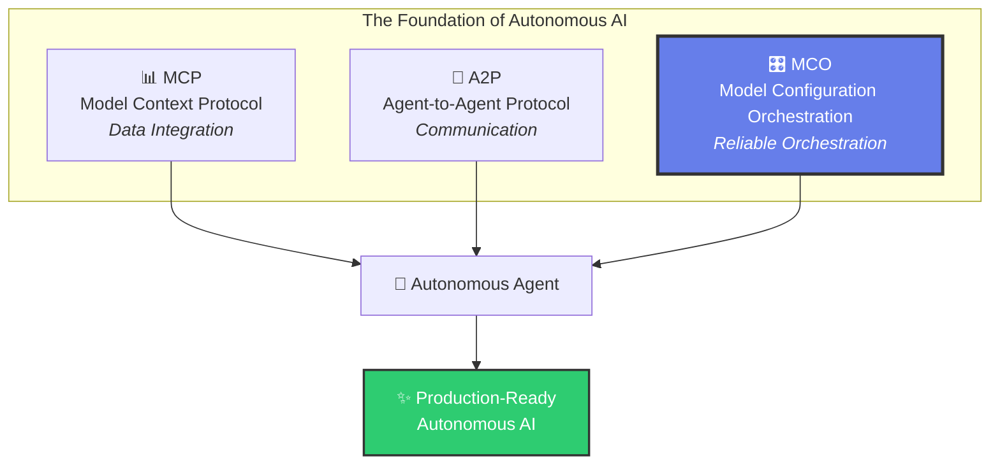
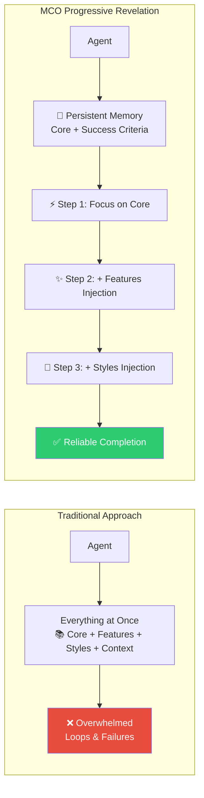
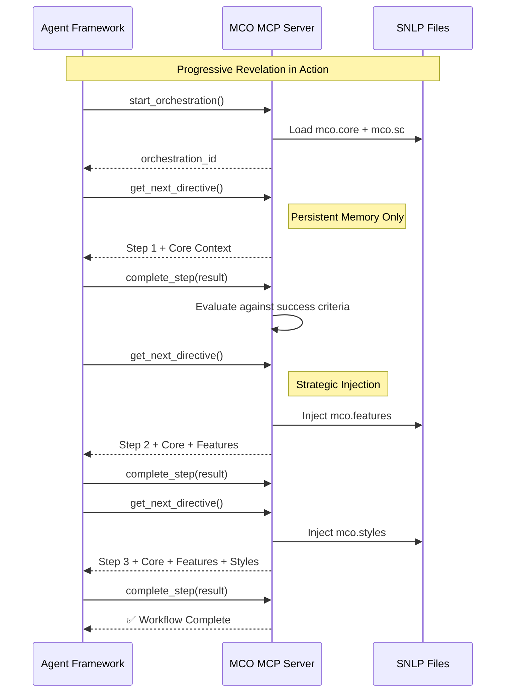
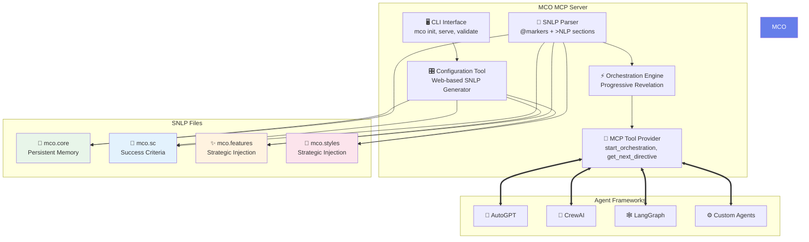
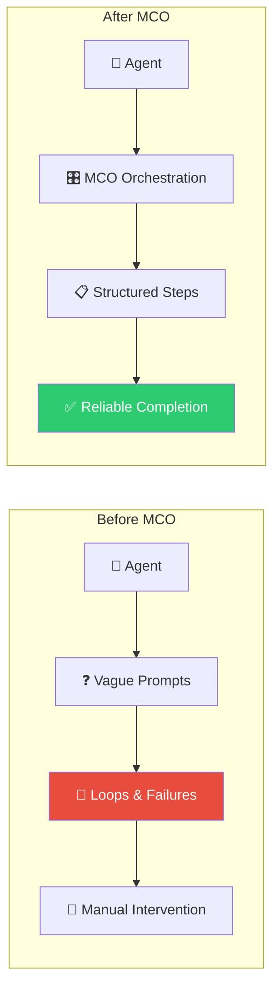

# 🚀 MCO Protocol: The Missing Orchestration Layer for MCP

<div align="center">

[](https://www.npmjs.com/package/@paradiselabs/mco-protocol)
[](https://opensource.org/licenses/MIT)
[](https://huggingface.co/Agents-MCP-Hackathon)

**Completing the Agentic Trifecta: MCP + A2P + MCO**

*Transform unreliable agents into structured, autonomous workflows with progressive revelation and persistent memory.*

[🎮 **Live Demo**](https://huggingface.co/spaces/paradiselabs/mco-protocol-demo) • [📦 **NPM Package**](https://www.npmjs.com/package/@paradiselabs/mco-protocol) • [📖 **Documentation**](https://github.com/paradiselabs-ai/MCO-Protocol/blob/main/docs)

</div>


## 🌟 The Agentic Trifecta



**Why MCO is Essential:**
- 📊 **MCP** connects agents to data sources → *"What can I access?"*
- 🤝 **A2P** enables agent communication → *"How do we coordinate?"*  
- 🎛️ **MCO** ensures reliable execution → *"How do we actually get things done?"*

## 🎯 The Problem MCO Solves

Traditional autonomous agents (AutoGPT, BabyAGI) suffer from:
- 🔄 **Endless loops** and failed executions
- 🧠 **Context overload** leading to poor decisions  
- 🎯 **Lack of focus** on core objectives
- 📉 **Unpredictable reliability** in production

## 💡 The MCO Solution: Progressive Revelation



## 🛠️ How MCO Works

### SNLP (Syntactic Natural Language Programming)

MCO uses a revolutionary programming language that combines structured syntax with natural language:

```yaml
# mco.core - Always in persistent memory
@workflow "Research Assistant"
>NLP An AI assistant that conducts autonomous research with reliability.

@data:
  topic: "AI Agent Orchestration"
  findings: []

@agents:
  researcher:
    steps:
      - "Research the topic thoroughly"
      - "Analyze patterns and insights"  
      - "Create comprehensive report"

# mco.features - Injected at 33% progress
@feature "Data Visualization"
>NLP Create charts and graphs when appropriate to enhance understanding.

# mco.styles - Injected at 66% progress  
@style "Professional Formatting"
>NLP Use clear headings, bullet points, and executive summary format.
```

### Orchestration Flow



## 🚀 Quick Start

### Installation

```bash
npm install -g @paradiselabs/mco-protocol
```

### Create Your First Workflow

```bash
# Initialize new MCO project
mco init my-research-assistant

# Opens configuration tool in browser
# Generates: mco.core, mco.sc, mco.features, mco.styles
```

### Add to Any MCP-Enabled Framework

Note: the directory mco-config is the directory which holds the four orchestration files, written in SNLP. This should go in your project directory. thus, the tool is able to be used even for IDE coding agent extensions or integrated coding agents, so long as the root of the current project contains a directory titled "mco-config/" and inside it contains the SNLP orchestration workflow files. 

```json
{
  "mcpServers": {
    "mco-orchestration": {
      "command": "npx",
      "args": ["@paradiselabs/mco-protocol", "serve", "./mco-config"]
    }
  }
}
```

### Use in Your Agent Framework

```python
# Works with ANY MCP-enabled framework
directive = mcp_client.call_tool("get_next_directive")
result = execute_task(directive.instruction)
mcp_client.call_tool("complete_step", step_id=directive.step_id, result=result)
```

## 🎭 Live Demo

**🎮 [Try the Interactive Demo](https://huggingface.co/spaces/paradiselabs/mco-protocol-demo)**

Generate real SNLP configurations and see MCO in action with live MCP server simulation.

## 📊 Architecture Overview



## 🏆 Perfect for MCP Hackathon 2025

**Track 1: MCP Server Implementation** ✅

MCO exemplifies the future of MCP by:
- 🔧 **Extending MCP's Vision**: Making agent orchestration as standardized as data access
- 🎯 **Solving Real Problems**: Transforming unreliable agents into production-ready systems
- 🚀 **Ready for Production**: Live NPM package, working implementation
- 🌟 **Innovative Approach**: First orchestration protocol designed specifically for MCP ecosystem

## 📈 Before vs After



## 🔗 Available MCP Tools

MCO exposes these tools through the MCP protocol:

| Tool | Description | Use Case |
|------|-------------|----------|
| `start_orchestration` | Initialize new workflow | Begin autonomous task |
| `get_next_directive` | Get next step with context | Progressive execution |
| `complete_step` | Mark step complete | Track progress |
| `get_workflow_status` | Check progress | Monitoring |
| `evaluate_against_criteria` | Quality assessment | Success validation |

## 🎨 CLI Commands

```bash
mco init [project-name]     # Create new MCO project
mco validate [config-dir]   # Validate SNLP files  
mco serve [config-dir]      # Start MCP server
mco templates              # List available templates
```

## 🤝 Contributing

We welcome contributions! MCO is designed to become the standard for agent orchestration.

1. Fork the repository
2. Create your feature branch (`git checkout -b feature/amazing-feature`)
3. Commit your changes (`git commit -m 'Add amazing feature'`)
4. Push to the branch (`git push origin feature/amazing-feature`)
5. Open a Pull Request

## 📜 License

MIT License - see [LICENSE](LICENSE) file for details.

## 🚀 Join the Revolution

**MCO Protocol is live and ready to transform how you build autonomous agents.**

- 📦 **Install**: `npm install -g @paradiselabs/mco-protocol`
- 🎮 **Demo**: [Interactive Gradio Space](https://huggingface.co/spaces/paradiselabs/mco-protocol-demo)
- 💬 **Discord**: [Join our community](https://discord.gg/uQ69vc4Agc)
- 🐦 **Twitter**: [@paradiselabs_ai](https://twitter.com/paradiselabs_ai)

---

<div align="center">

**🌟 Star this repository if MCO helps you build better agents! 🌟**

*Made with ❤️ by [Paradise Labs](https://paradiselabs.co)*

</div>
