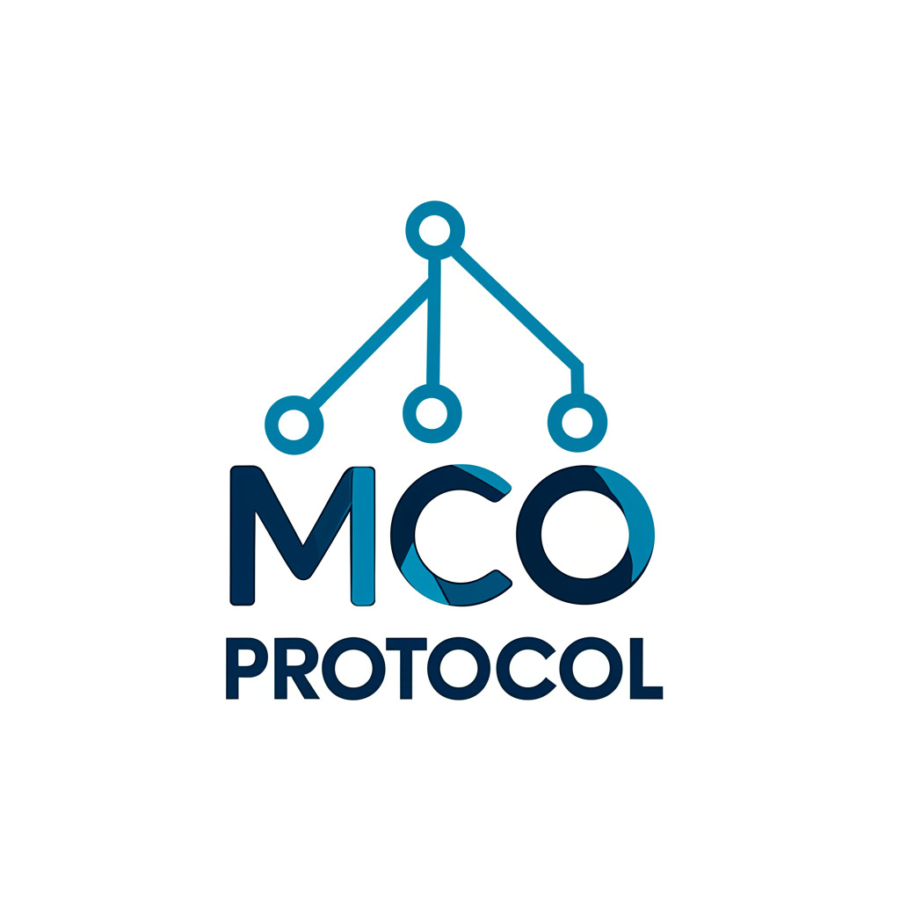

<p align="center">

</p>
<p align="center">
  
</p>

# MCO Protocol

Model Configuration Orchestration (MCO) Server is a lightweight orchestration layer that makes AI agents dramatically more reliable by maintaining core requirements in persistent memory while strategically introducing implementation details at the right moments.

## Features

- **Framework Agnostic**: Works with virtually any agentic workflow or framework
- **Syntactical Natural Language Programming (SNLP)**: Combines structured syntax with natural language for reliable agent guidance
- **Progressive Revelation**: Strategically introduces features and styles at the right moments in the workflow
- **Success Criteria Tracking**: Explicitly evaluates progress against defined success criteria
- **Persistent Memory**: Maintains core requirements throughout the entire process

## Why MCO?

Traditional agent frameworks often struggle with reliability, determinism, and focus. MCO was created to solve these challenges by introducing a structured approach to agent orchestration that maintains the benefits of natural language while adding the reliability of structured programming. The MCO Protocol is a new standard for reliable, deterministic autonomous agentic orchestration that addresses the challenges of traditional agentic systems through structured workflows and progressive revelation. Think about the complete autonomy of AutoGPT, AgentGPT, etc. - MCO is the missing piece of Agent, Auto, BabyAGI or GPT or anything else. It allows for easily orchestrated robust and reliable results, prevents hallucinations, and provides a progressive feedback loop that builds on itself to iteratively complete the task, or continue is on-going job. Whether giving you a daily news update, checking your stocks, posting on social media, and with the goal of eventually even entireprise-level, complex multi-step, multi-agentic pipelines for industrial/factory autonomy in control systems.


## Core Concepts

MCO introduces several key innovations:

### Structured Orchestration vs. Traditional Approaches

```mermaid
graph TD
    subgraph Traditional ["Traditional Agent Approach"]
        TA[Single Prompt] --> TB[Agent]
        TB --> TC[Result]
        style TA fill:#f5f5f5,stroke:#333,color:#000000
        style TB fill:#f5f5f5,stroke:#333,color:#000000
        style TC fill:#f5f5f5,stroke:#333,color:#000000
    end
    
    subgraph MCO ["MCO Protocol Approach"]
        MA[Core Definition] --> MB[Persistent Memory]
        MC[Success Criteria] --> MB
        MD[Core Features] --> MB
        MB --> ME[Agent]
        ME --> MF[Task 1]
        MF --> MG[Task 2]
        MG --> MH[Final Result]
        
        MI[Progressive Injection: Secondary Features] -.-> MF
        MI -.-> MG
        MJ[Progressive Injection: Styles (i.e. UI/UX development)] -.-> MF
        MJ -.-> MG
        
        style MA fill:#e1f5fe,stroke:#0277bd,color:#000000
        style MB fill:#e8f5e9,stroke:#2e7d32,color:#000000
        style MC fill:#e1f5fe,stroke:#0277bd,color:#000000
        style MD fill:#e1f5fe,stroke:#0277bd,color:#000000
        style ME fill:#fff3e0,stroke:#e65100,color:#000000
        style MF fill:#f3e5f5,stroke:#6a1b9a,color:#000000
        style MG fill:#f3e5f5,stroke:#6a1b9a,color:#000000
        style MH fill:#e8eaf6,stroke:#303f9f,color:#000000
        style MI fill:#ffebee,stroke:#c62828,color:#000000
        style MJ fill:#fff8e1,stroke:#ff8f00,color:#000000
    end
```

### Key Components

1. **Persistent vs. Injected Memory**
   - **Persistent Memory**: Core definitions and success criteria that remain available throughout the entire process
   - **Progressive Injection**: Features and styles injected at strategic points to guide the agent without overwhelming it

2. **Syntactic Natural Language Programming (SNLP)**
   - A new programming language for literally orchestrating AI that blends natural language and structured syntax that makes orchestration both human-readable and machine-parsable
   - Uses `@data` markers and `>NLP` directives to structure information

3. **Multi-File Structure**
   - `.core` - Core workflow definition and persistent data
   - `.sc` - Success criteria for evaluation (also stays persistent)
   - `.features` - Feature specifications injected progressively (optional)
   - `.styles` - Style guidelines injected progressively (optional)

## Getting Started

### Installation (Soon - for now just clone the repo)

```bash
pip install mco-protocol
```

### Basic Usage

1. Create your MCO files:

```
# mco.core
@workflow "Research Assistant"
@description "A workflow for researching and summarizing information on a topic."
@version "1.0"

@data:
  topic: "Artificial Intelligence"
> "Focus on recent developments in AI agents and orchestration."

@agents:
  researcher:
    model: "gpt-4"
    description: "Researches information and finds relevant sources"
```

2. Start the MCO server:

```python
from mco_server import MCOServer

server = MCOServer()
server.start_api_server()
```

3. Use the MCO client to run an orchestration:

```python
from mco_client import MCOClient

client = MCOClient()
orchestration_id = client.start_orchestration(
    config_dir="./mco_files",
    adapter_name="lmstudio",
    adapter_config={"model_name": "llama3"}
)
```

## LM Studio Integration

MCO Protocol works particularly well with LM Studio, transforming its capabilities from a simple chat interface into a powerful, orchestrated agent pipeline. By leveraging MCO's structured approach with LM Studio's Python SDK, you can create reliable, deterministic agent workflows even with less sophisticated base frameworks.

# Learn More Below

## Documentation

For detailed documentation, see the [docs](./docs) directory:

- [Integration Examples](./docs/integration_examples.md)
- [File Types](./docs/file_types.md)
- [Visual Setup Tool Design](./docs/visual_setup_tool_design.md)

## Examples

The [examples](./examples) directory contains sample MCO configurations for various use cases:

- [Research Assistant](./examples/research_assistant/)
- [Product Development](./examples/product_development/) (COMING SOON)
- [Code Generation](./examples/code_generation/) (COMING SOON)

## Contributing

Contributions are welcome! Please see [CONTRIBUTING.md](./CONTRIBUTING.md) for details.

## License

This project is licensed under the MIT License - see the [LICENSE](./LICENSE) file for details.

## Contact

- Website: [https://paradiselabs.co](https://paradiselabs.co)
- Email: developers@paradiselabs.co
- Twitter: [@paradiselabs_ai](https://twitter.com/paradiselabs_ai)
- Discord: [https://discord.gg/uQ69vc4Agc](https://discord.gg/uQ69vc4Agc)
