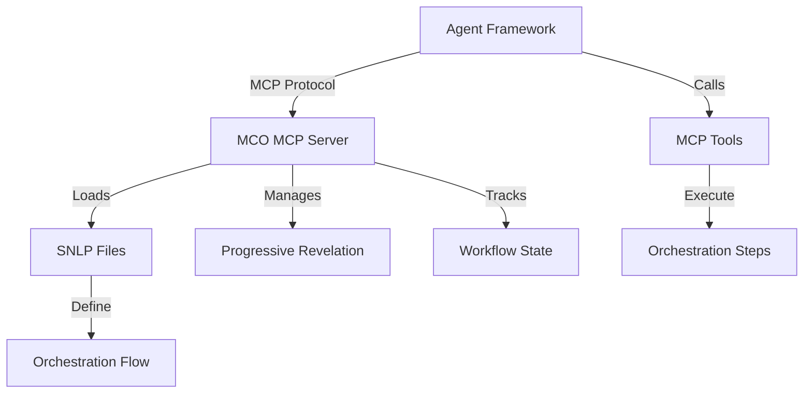

<p align="center">

</p>
<p align="center">
  
</p>

# MCO Protocol

Model Configuration Orchestration (MCO) Server is a lightweight orchestration layer that makes AI agents dramatically more reliable by maintaining core requirements in persistent memory while strategically introducing implementation details at the right moments.

## Features

- **Framework Agnostic**: Works with virtually any agentic workflow or framework
- **Syntactical Natural Language Programming (SNLP)**: Combines structured syntax with natural language for reliable agent guidance
- **Progressive Revelation**: Strategically introduces features and styles at the right moments in the workflow
- **Success Criteria Tracking**: Explicitly evaluates progress against defined success criteria
- **Persistent Memory**: Maintains core requirements throughout the entire process

## Why MCO?

Traditional agent frameworks often struggle with reliability, determinism, and focus. MCO was created to solve these challenges by introducing a structured approach to agent orchestration that maintains the benefits of natural language while adding the reliability of structured programming. The MCO Protocol is a new standard for reliable, deterministic autonomous agentic orchestration that addresses the challenges of traditional agentic systems through structured workflows and progressive revelation. Think about the complete autonomy of AutoGPT, AgentGPT, etc. - MCO is the missing piece of Agent, Auto, BabyAGI or GPT or anything else. It allows for easily orchestrated robust and reliable results, prevents hallucinations, and provides a progressive feedback loop that builds on itself to iteratively complete the task, or continue is on-going job. Whether giving you a daily news update, checking your stocks, posting on social media, and with the goal of eventually even entireprise-level, complex multi-step, multi-agentic pipelines for industrial/factory autonomy in control systems.


# MCO As An MCP Server Packeged With An Easy Configuration Tool

This repository contains the implementation of the MCO (Model Configuration Orchestration) Protocol MCP Server and Configuration Tool, designed to provide robust, and uniquely innovative autonomous orchestration capabilities to any agent framework with a single MCP Server.

## Overview

The MCO Protocol operates as an MCP (Model Context Protocol) server, exposing orchestration tools through the MCP protocol. This allows any MCP-enabled framework (AutoGPT, CrewAI, etc.) to use MCO by adding one line to their MCP config.



## Key Features

- **Framework Agnostic**: Works with any MCP-enabled agent framework
- **Progressive Revelation**: Strategically reveals information to agents at the right time
- **SNLP Configuration**: Uses Syntactic Natural Language Programming for workflow definition
- **Web-based Configuration Tool**: Easy creation of SNLP files through a guided interface
- **Success Criteria Evaluation**: Automatically evaluates agent outputs against defined criteria

## Installation

```bash
npm install -g @paradiselabs/mco-protocol
```

## Quick Start

1. **Create a new MCO project**:
   ```bash
   mco init my-project
   ```
   This opens the configuration tool in your browser.

2. **Configure your workflow**:
   - Define workflow steps
   - Set success criteria
   - Add features and styling preferences
   - Export SNLP files

3. **Add to your MCP config**:
   ```json
   {
     "mcpServers": {
       "mco-orchestration": {
         "command": "mco-server",
         "args": ["--config-dir", "./my-project"]
       }
     }
   }
   ```

4. **Use in your agent framework**:
   ```python
   # Example with any MCP-enabled framework
   directive = mcp_client.call_tool("get_next_directive")
   result = execute_task(directive.instruction)
   mcp_client.call_tool("complete_step", step_id=directive.step_id, result=result)
   ```

## SNLP File Structure

MCO uses four SNLP files to define the orchestration workflow:

- **mco.core**: Defines workflow, data variables, and workflow steps
- **mco.sc**: Defines goal, success criteria, target audience, and developer vision
- **mco.features**: Defines features to be injected during implementation steps
- **mco.styles**: Defines styling preferences to be injected during formatting steps

## Progressive Revelation

MCO implements progressive revelation to improve agent reliability:

- **Persistent Memory**: Content from `mco.core` and `mco.sc` is always available
- **Strategic Injection**: Content from `mco.features` and `mco.styles` is injected at strategic points
- **Step Analysis**: Injection points are determined by analyzing step tasks or using default positions

## MCP Tools

MCO exposes the following tools through the MCP protocol:

### Workflow Management
- `start_orchestration`: Start a new orchestration workflow
- `get_next_directive`: Get the next directive for the current orchestration
- `complete_step`: Complete the current step in the orchestration
- `get_workflow_status`: Get the current status of the workflow

### Success Criteria
- `evaluate_against_criteria`: Evaluate a result against the defined success criteria

### State Management
- `get_persistent_context`: Get the persistent context for the current orchestration
- `set_workflow_variable`: Set a workflow variable
- `get_workflow_variable`: Get a workflow variable

## CLI Commands

- `mco init [project-name]`: Create new MCO project with config tool
- `mco validate [config-dir]`: Validate SNLP files
- `mco serve [config-dir]`: Start MCP server
- `mco templates`: List available templates
- `mco deploy [config-dir]`: Deploy to cloud MCP service (coming soon)

## Architecture

The MCO MCP Server consists of the following components:

- **SNLP Parser**: Parses and interprets SNLP files
- **Orchestration Engine**: Manages workflow state and progressive revelation
- **MCP Tool Provider**: Exposes orchestration tools through the MCP protocol
- **Configuration Tool**: Web-based interface for creating SNLP files

## Development

To contribute to this project:

1. Clone the repository
2. Install dependencies: `npm install`
3. Run tests: `npm test`
4. Start development server: `npm run dev`

## License

MIT
