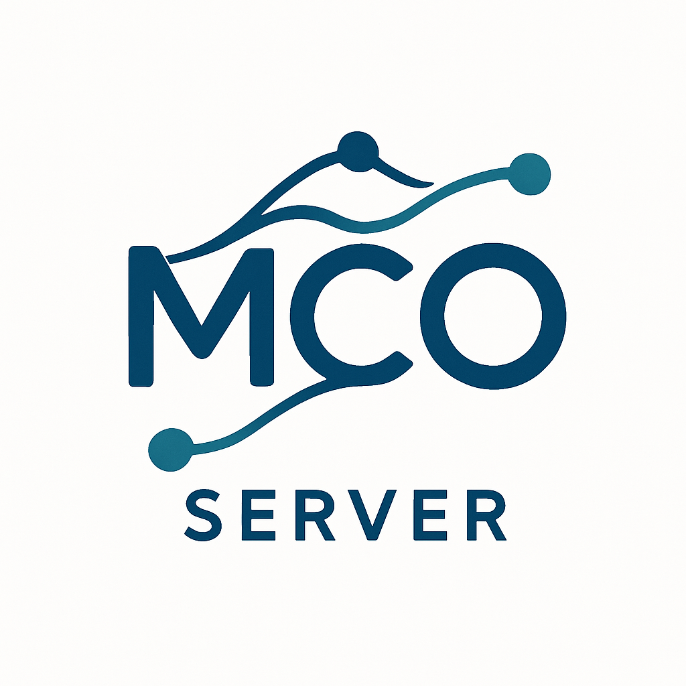

# MCO Server

[](https://opensource.org/licenses/MIT)
[](https://www.python.org/downloads/)
[](https://github.com/mco-protocol/mco-server)

<p align="center">
  
</p>

<p align="center">
  <b>Model Configuration Orchestration Server</b><br>
  A framework-agnostic orchestration layer for reliable AI agent workflows
</p>

## Overview

MCO Server is an open-source orchestration system that guides AI agents through complex workflows while maintaining explicit success criteria. It provides a standardized way to orchestrate AI agents across different frameworks, ensuring reliable, high-quality outputs.

Unlike traditional "vibe coding" approaches where AI agents operate without clear guidance, MCO Server provides structured orchestration with explicit success criteria evaluation, dramatically improving reliability and output quality.

## Key Features

- **Framework Agnosticism**: Works with any AI agent framework through adapters
- **Success-Driven Design**: Built around explicit success criteria evaluation
- **Server-Based Architecture**: Centralized orchestration with distributed execution
- **Persistent State**: Maintains workflow state across interactions
- **Flexible Integration**: Multiple integration patterns for any use case

## Quick Start

### Installation

```bash
pip install mco-server
```

### Basic Usage

```python
from mco_server import MCOServer

# Initialize server
server = MCOServer()

# Start orchestration
orchestration_id = server.start_orchestration(
    config_dir="./my_project/mco",
    adapter_name="lmstudio"
)

# Run orchestration loop
while True:
    # Get next directive
    directive = server.get_next_directive(orchestration_id)
    
    if directive["type"] == "complete":
        print("Orchestration complete!")
        break
    
    print(f"\n--- Step: {directive['step_id']} ---")
    print(f"Instruction: {directive['instruction']}")
    
    # Execute directive
    result = server.execute_directive(orchestration_id)
    
    # Print evaluation
    evaluation = result["evaluation"]
    print(f"Success: {evaluation['success']}")
    print(f"Feedback: {evaluation['feedback']}")
    print(f"Progress: {evaluation['progress'] * 100:.0f}%")
```

## Documentation

- [Getting Started](docs/getting-started.md)
- [Configuration Files](docs/configuration.md)
- [Framework Adapters](docs/adapters.md)
- [API Reference](docs/api-reference.md)
- [Examples](docs/examples.md)

## Supported Frameworks

MCO Server currently supports the following frameworks through adapters:

- [LM Studio Python SDK](https://lmstudio.ai)
- [AgentGPT](https://agentgpt.reworkd.ai)
- [SuperExpert](https://superexpert.ai)
- Custom frameworks (via adapter API)

## Contributing

We welcome contributions to MCO Server! Please see our [Contributing Guide](CONTRIBUTING.md) for more information.

## License

MCO Server is licensed under the [MIT License](LICENSE).
