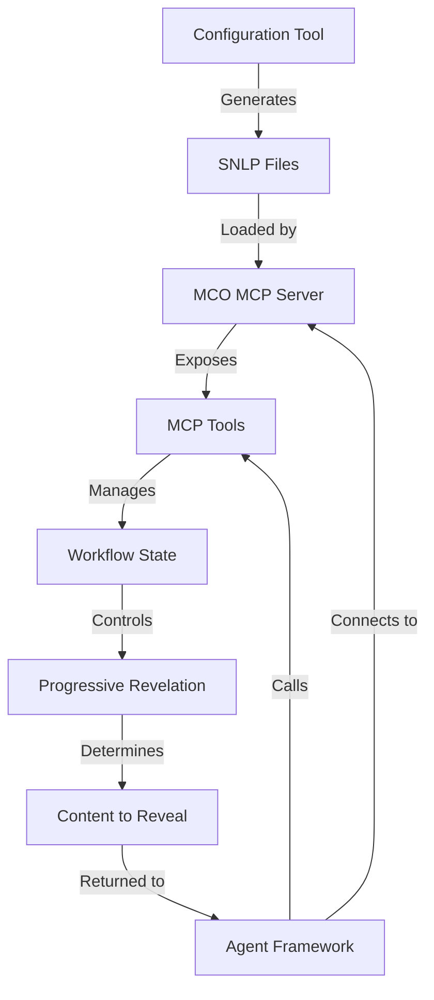

# MCO MCP Server & Configuration Tool - Architecture

## Overview

The MCO MCP Server is designed as a framework-agnostic orchestration system that exposes its functionality through the Model Context Protocol (MCP). This architecture document outlines the high-level design and module breakdown for both the server and configuration tool components.

## Core Architecture

```
MCO MCP Server
├── SNLP Parser
│   ├── Core Parser (mco.core)
│   ├── Success Criteria Parser (mco.sc)
│   ├── Features Parser (mco.features)
│   └── Styles Parser (mco.styles)
├── Orchestration Engine
│   ├── Workflow State Manager
│   ├── Progressive Revelation Controller
│   └── Success Criteria Evaluator
├── MCP Tool Providers
│   ├── Workflow Management Tools
│   ├── Success Criteria Tools
│   └── State Management Tools
└── Server Infrastructure
    ├── MCP Protocol Handler
    ├── WebSocket Server
    └── CLI Interface
```

## Module Breakdown

### 1. SNLP Parser

**Purpose**: Parse and interpret the Syntactic Natural Language Programming files that define the orchestration workflow.

**Key Components**:
- **Parser Core**: Handles common parsing logic and syntax validation
- **File-Specific Parsers**: Specialized parsers for each file type (core, sc, features, styles)
- **Marker Processor**: Processes `@marker` syntax and associates with content
- **NLP Extractor**: Extracts and processes `>NLP` sections

**Interfaces**:
- `parseFile(filePath: string): ParsedContent`
- `parseDirectory(dirPath: string): ParsedWorkflow`
- `validateSNLP(content: string): ValidationResult`

### 2. Orchestration Engine

**Purpose**: Manage the workflow state and control the progressive revelation of content to the agent.

**Key Components**:
- **Workflow State Manager**: Tracks current step, completed steps, and workflow variables
- **Progressive Revelation Controller**: Determines what content to reveal at each step
- **Success Criteria Evaluator**: Evaluates results against defined success criteria

**Interfaces**:
- `startOrchestration(config: object): OrchestrationId`
- `getNextDirective(orchestrationId: string): Directive`
- `completeStep(orchestrationId: string, stepId: string, result: object): StepResult`
- `getWorkflowStatus(orchestrationId: string): WorkflowStatus`

### 3. MCP Tool Providers

**Purpose**: Expose orchestration functionality as MCP tools that can be called by any MCP-enabled agent framework.

**Key Components**:
- **Tool Registry**: Registers and manages available MCP tools
- **Tool Handlers**: Implements the logic for each MCP tool
- **Response Formatter**: Formats tool responses according to MCP specifications

**Tools Exposed**:
- **Workflow Management Tools**:
  - `start_orchestration`
  - `get_next_directive`
  - `complete_step`
  - `get_workflow_status`
- **Success Criteria Tools**:
  - `evaluate_against_criteria`
- **State Management Tools**:
  - `get_persistent_context`
  - `set_workflow_variable`
  - `get_workflow_variable`

### 4. Server Infrastructure

**Purpose**: Handle communication with agent frameworks and provide the server runtime environment.

**Key Components**:
- **MCP Protocol Handler**: Implements the MCP protocol specification
- **WebSocket Server**: Provides real-time communication with agent frameworks
- **CLI Interface**: Command-line interface for starting and managing the server

**Interfaces**:
- `startServer(options: ServerOptions): Server`
- `registerClient(client: WebSocket): ClientId`
- `handleToolCall(clientId: string, toolCall: ToolCall): ToolResponse`

## Configuration Tool Architecture

```
MCO Configuration Tool
├── UI Components
│   ├── Template Selector
│   ├── Form Builder
│   ├── SNLP Editor
│   └── Preview Panel
├── Template System
│   ├── Template Registry
│   └── Template Renderer
├── SNLP Generator
│   ├── Core Generator
│   ├── SC Generator
│   ├── Features Generator
│   └── Styles Generator
└── Export System
    ├── File Exporter
    ├── Clipboard Manager
    └── Server Deployer
```

### 1. UI Components

**Purpose**: Provide the user interface for creating and editing SNLP files.

**Key Components**:
- **Template Selector**: Allows users to select from predefined templates
- **Form Builder**: Dynamic form fields based on selected template
- **SNLP Editor**: Direct editing of generated SNLP files
- **Preview Panel**: Real-time preview of generated files

### 2. Template System

**Purpose**: Manage and apply templates for common workflow types.

**Key Components**:
- **Template Registry**: Stores and manages available templates
- **Template Renderer**: Applies templates to generate initial SNLP content

### 3. SNLP Generator

**Purpose**: Generate valid SNLP files based on user input.

**Key Components**:
- **Core Generator**: Generates mco.core file
- **SC Generator**: Generates mco.sc file
- **Features Generator**: Generates mco.features file
- **Styles Generator**: Generates mco.styles file

### 4. Export System

**Purpose**: Export generated SNLP files in various formats.

**Key Components**:
- **File Exporter**: Exports files to disk
- **Clipboard Manager**: Copies content to clipboard
- **Server Deployer**: Deploys directly to MCO MCP server

## Integration Flow

1. User creates SNLP files using the Configuration Tool
2. Files are saved to a project directory
3. MCO MCP Server is started with the project directory as input
4. Agent framework connects to the MCO MCP Server via MCP protocol
5. Agent framework calls MCP tools to orchestrate the workflow
6. MCO MCP Server manages the workflow state and progressive revelation

## Progressive Revelation Implementation

**Persistent Memory (Always Available)**:
- All content from `mco.core`
- All content from `mco.sc`
- Current workflow state

**Strategic Injection (Step-Based)**:
- `mco.features`: Injected during implementation/development steps
- `mco.styles`: Injected during formatting/presentation steps

**Injection Logic**:
1. Analyze step tasks for keywords ("implement", "develop", "style", "format")
2. Use default positions if no keywords found (features at 1/3, styles at 2/3 of workflow)
3. Track injection history to avoid duplicate injections

## Data Flow



## Deployment Architecture

The MCO MCP Server is designed to be deployed in various configurations:

1. **Local Development**: Run locally during development
2. **Agent Integration**: Run as a child process of an agent framework
3. **Standalone Service**: Run as a standalone service that agent frameworks connect to

The Configuration Tool is designed as a static web application that can be:

1. **Opened locally**: When running `mco init`
2. **Hosted online**: For easy access without installation
3. **Embedded in other tools**: For integration with existing agent development environments
