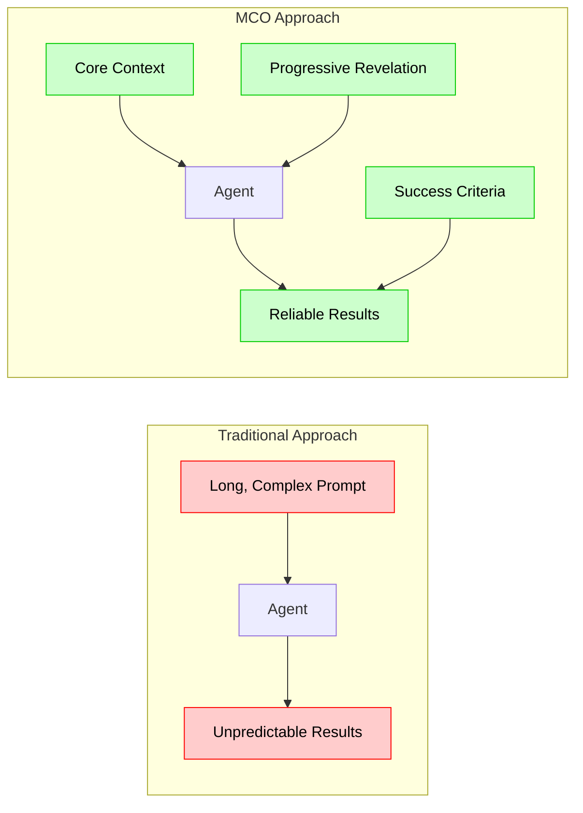
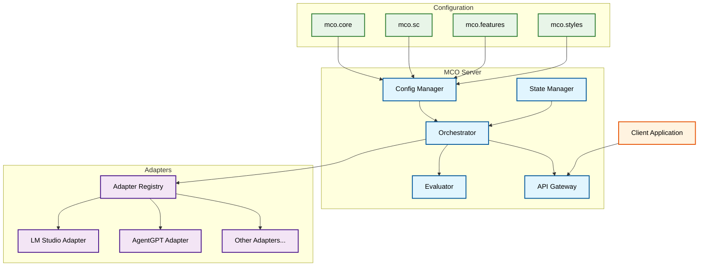
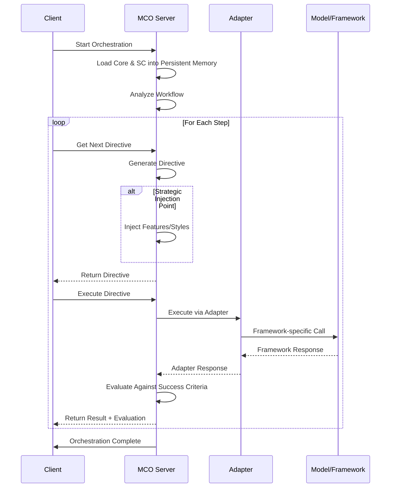
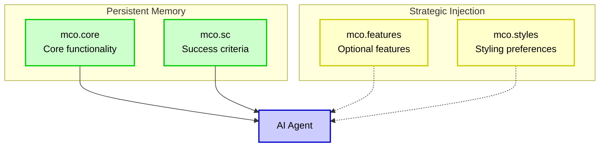

# MCO Protocol Documentation

## What is MCO?

MCO (Multi-Context Orchestration) is a framework-agnostic protocol for orchestrating AI agents with improved reliability and predictability. Unlike traditional "vibe coding" approaches where agents operate with minimal guidance, MCO provides structured orchestration with progressive revelation of information and explicit success criteria evaluation.

## Table of Contents

1. [Core Concepts](#core-concepts)
2. [Architecture](#architecture)
3. [SNLP Syntax Guide](#snlp-syntax-guide)
4. [File Types](#file-types)
5. [Integration Examples](#integration-examples)
6. [API Reference](#api-reference)
7. [Adapter Development](#adapter-development)

## Core Concepts

### The Problem: "Vibe Coding" vs. Structured Orchestration



Traditional approaches to AI agent orchestration often rely on "vibe coding" - providing a single, lengthy prompt and hoping the agent understands and executes correctly. This leads to:

- **Memory limitations**: Agents struggle to remember all details from long prompts
- **Context confusion**: Agents lose track of priorities and requirements
- **Hallucinations**: Agents fill in gaps with incorrect assumptions
- **Inconsistent results**: The same prompt produces different results each time

MCO solves these problems through:

1. **Progressive Revelation**: Information is provided to agents in a structured, sequential manner
2. **Persistent vs. Injected Context**: Core information stays in memory while details are injected when needed
3. **Success Criteria Evaluation**: Explicit evaluation of results against defined criteria
4. **Syntactical Natural Language Programming (SNLP)**: A hybrid approach combining structured syntax with natural language

### The Painting Analogy

To understand how MCO works, imagine two identical painters tasked with creating a complex cityscape:

#### Version 1: Traditional "Vibe Coding" Approach
1. The painter receives extremely detailed instructions for the entire painting at once
2. The painter tries to remember everything while working
3. Upon reviewing the instructions again, the painter realizes they've made mistakes and painted elements out of order
4. The painter must erase and redo significant portions of work

#### Version 2: MCO Approach
1. The painter first receives core instructions: "Paint a landscape with a river in the middle"
2. After completing this foundation, they receive the next instruction: "Add a small boat cruising down the river"
3. Each new instruction builds on the previous work in a logical sequence
4. The painter can focus on each element without being overwhelmed

MCO works similarly by providing core context that stays in persistent memory while strategically revealing additional details at the right moments in the agent's workflow.

## Architecture

MCO follows a modular architecture designed for flexibility and framework independence:



### Component Flow



## SNLP Syntax Guide

Syntactical Natural Language Programming (SNLP) is the core syntax used in MCO files. It combines structured markers with natural language to create a hybrid approach that is both machine-parsable and human-readable.

### Basic Syntax

```
@marker Identifier
>NLP Natural language content that provides context, instructions, or details.
```

- **@marker**: Defines the type of content that follows
- **Identifier**: Names or categorizes the content (optional for some markers)
- **>NLP**: Indicates natural language content follows

### Example SNLP Syntax

```
@data Research capability
>NLP The agent should be able to search for information on a given topic using available tools.

@data Analysis capability
>NLP The agent should analyze and synthesize information from multiple sources, identifying patterns and insights.
```

### Common Markers

| Marker | Purpose | Example |
|--------|---------|---------|
| `@data` | Defines a data point or capability | `@data Search capability` |
| `@workflow` | Defines workflow metadata | `@workflow "Research Assistant"` |
| `@goal` | Defines the overall goal | `@goal "Create a comprehensive research report"` |
| `@success_criteria` | Defines evaluation criteria | `@success_criteria "Contains at least 3 sources"` |
| `@optional` | Defines optional features | `@optional Advanced visualization` |
| `@style` | Defines styling preferences | `@style "Academic writing style"` |

### Progressive Structure

SNLP follows a progressive structure where each new element builds on previous ones:

```
@data Foundation
>NLP First, establish the basic structure.

@data Building blocks
>NLP Next, add the core components that build on the foundation.

@data Advanced features
>NLP Finally, incorporate advanced features that enhance the core components.
```

This progressive approach mirrors how software development naturally occurs - starting with foundations and building up in layers.

## File Types

MCO uses four file types to organize orchestration logic:



### 1. mco.core

Contains essential functionality that stays in persistent memory throughout the orchestration.

**Example mco.core file:**

```
# Core functionality for Research Assistant

@workflow "Research Assistant"
>NLP An AI assistant that helps users research topics and create comprehensive reports.

@data Research capability
>NLP The agent should be able to search for information on a given topic using available tools.

@data Analysis capability
>NLP The agent should analyze and synthesize information from multiple sources, identifying patterns and insights.

@data Report generation
>NLP The agent should generate well-structured reports with clear sections and logical flow.
```

### 2. mco.sc (Success Criteria)

Defines criteria for evaluating success, also kept in persistent memory.

**Example mco.sc file:**

```
# Success criteria for Research Assistant

@goal "Create comprehensive research reports on user-specified topics"
>NLP The goal is to produce well-researched, accurate, and insightful reports that meet academic standards.

@success_criteria Comprehensive coverage
>NLP The report should cover multiple aspects of the topic, not just the most obvious ones.

@success_criteria Multiple sources
>NLP The report should incorporate information from at least 3 different reputable sources.

@success_criteria Factual accuracy
>NLP All information provided must be factually accurate and properly attributed.

@success_criteria Logical structure
>NLP The report should follow a logical structure with clear introduction, body, and conclusion.
```

### 3. mco.features

Contains optional features that are injected at strategic points in the workflow.

**Example mco.features file:**

```
# Optional features for Research Assistant

@optional Data visualization
>NLP When appropriate, create charts or graphs to visualize key data points or trends.

@optional Counterarguments
>NLP Include a section addressing potential counterarguments or alternative perspectives.

@optional Future implications
>NLP Discuss potential future implications or developments related to the topic.

@optional Case studies
>NLP Incorporate relevant case studies or examples that illustrate key points.
```

### 4. mco.styles

Defines styling preferences that are injected during formatting or presentation steps.

**Example mco.styles file:**

```
# Styling preferences for Research Assistant

@style Writing style
>NLP Use a formal, academic writing style with proper citations and references.

@style Formatting
>NLP Use clear headings and subheadings to organize content. Include a table of contents for reports longer than 1000 words.

@style Citations
>NLP Use APA citation format for all references.

@style Visual elements
>NLP Keep visual elements clean and minimal. Use a consistent color scheme for all charts and graphs.
```

## Integration Examples

### LM Studio Integration

LM Studio is primarily known as a chat interface for local LLMs, but with MCO, it can be transformed into a reliable agent orchestration platform:

```python
from mco_server import MCOServer
from mco_server.adapters.lmstudio import LMStudioAdapter

# Initialize MCO Server
server = MCOServer()

# Start orchestration with LM Studio adapter
orchestration_id = server.start_orchestration(
    config_dir="./examples/research_assistant/",
    adapter_name="lmstudio",
    adapter_config={"model_name": "llama3-8b"}
)

# Run orchestration loop
while True:
    # Get next directive
    directive = server.get_next_directive(orchestration_id)
    
    if directive["type"] == "complete":
        print("Orchestration complete!")
        break
    
    print(f"\n--- Step {directive['step_index'] + 1}/{directive['total_steps']} ---")
    print(f"Instruction: {directive['instruction']}")
    
    # Execute directive
    result = server.execute_directive(orchestration_id)
    
    # Process result
    evaluation = server.process_result(orchestration_id, result)
    print(f"Success: {evaluation['success']}")
    print(f"Feedback: {evaluation['feedback']}")
```

### Basic API Server

For web-based applications, you can run MCO as an API server:

```python
from mco_server import MCOServer

# Initialize server
server = MCOServer()

# Start API server
server.start_api_server(host="0.0.0.0", port=8000)

print("MCO Server API running on http://0.0.0.0:8000")
```

## API Reference

MCO provides a RESTful API for interacting with orchestrations:

### Start Orchestration

```
POST /api/v1/orchestration
```

Request body:
```json
{
  "config_dir": "./examples/research_assistant/",
  "adapter_name": "lmstudio",
  "adapter_config": {
    "model_name": "llama3-8b"
  }
}
```

Response:
```json
{
  "orchestration_id": "123e4567-e89b-12d3-a456-426614174000",
  "status": "initialized"
}
```

### Get Next Directive

```
GET /api/v1/orchestration/{orchestration_id}/directive
```

Response:
```json
{
  "type": "execute",
  "instruction": "Research the topic of quantum computing",
  "step_index": 0,
  "total_steps": 3,
  "success_criteria": "The research should identify at least 3 key areas in quantum computing"
}
```

### Execute Directive

```
POST /api/v1/orchestration/{orchestration_id}/execute
```

Response:
```json
{
  "result": "I've researched quantum computing and identified these key areas: 1) Quantum Algorithms, 2) Quantum Hardware, 3) Quantum Error Correction, 4) Quantum Applications, 5) Quantum Software Development",
  "evaluation": {
    "success": true,
    "feedback": "Successfully identified 5 key areas, exceeding the requirement of 3",
    "progress": 0.33
  }
}
```

## Adapter Development

MCO supports multiple AI frameworks through adapters. Here's how to create a new adapter:

### Adapter Interface

All adapters must implement the `BaseAdapter` interface:

```python
from abc import ABC, abstractmethod
from typing import Dict, Any

class BaseAdapter(ABC):
    """Base class for all MCO adapters."""
    
    def __init__(self, config: Dict[str, Any]):
        """Initialize the adapter with configuration."""
        self.config = config
    
    @abstractmethod
    def execute(self, directive: Dict[str, Any]) -> Dict[str, Any]:
        """Execute a directive using the framework."""
        pass
    
    @abstractmethod
    def evaluate(self, result: Dict[str, Any], criteria: Dict[str, Any]) -> Dict[str, Any]:
        """Evaluate a result against success criteria."""
        pass
    
    @abstractmethod
    def cleanup(self) -> None:
        """Clean up any resources used by the adapter."""
        pass
```

### Example Adapter Implementation

Here's a simplified example of the LM Studio adapter:

```python
from mco_server.adapters.base import BaseAdapter
import lmstudio

class LMStudioAdapter(BaseAdapter):
    """Adapter for LM Studio."""
    
    def __init__(self, config):
        super().__init__(config)
        
        # Initialize LM Studio client
        self.client = lmstudio.llm(
            model_name=config.get("model_name"),
            host=config.get("host", "localhost"),
            port=config.get("port", 1234)
        )
        self.chat = lmstudio.Chat()
    
    def execute(self, directive):
        # Extract directive content
        content = directive.get("content", "")
        
        # Create system prompt
        system_prompt = "You are a helpful AI assistant."
        self.chat = lmstudio.Chat(system_prompt)
        
        # Add user message
        self.chat.add_user_message(content)
        
        # Generate response
        response = self.client.respond(self.chat)
        
        return {
            "result": response,
            "metadata": {
                "model": self.config.get("model_name")
            }
        }
    
    def evaluate(self, result, criteria):
        # Implementation of evaluation logic
        # ...
        
        return {
            "success": 0.9,
            "feedback": "Evaluation feedback"
        }
    
    def cleanup(self):
        self.client = None
        self.chat = None
```

### Registering an Adapter

To make your adapter available to MCO:

```python
from mco_server import MCOServer
from my_custom_adapter import MyCustomAdapter

# Initialize server
server = MCOServer()

# Register custom adapter
server.register_adapter("my_framework", MyCustomAdapter)

# Use the adapter
orchestration_id = server.start_orchestration(
    config_dir="./my_project/",
    adapter_name="my_framework",
    adapter_config={"model_name": "my-model"}
)
```

## Conclusion

MCO provides a structured approach to AI agent orchestration that dramatically improves reliability and output quality. By using progressive revelation, persistent vs. injected context, and explicit success criteria evaluation, MCO transforms simple LLM interfaces into powerful, reliable agent orchestration platforms.

For more information, examples, and updates, visit the [MCO Protocol GitHub repository](https://github.com/paradiselabs-ai/MCO-Protocol).
